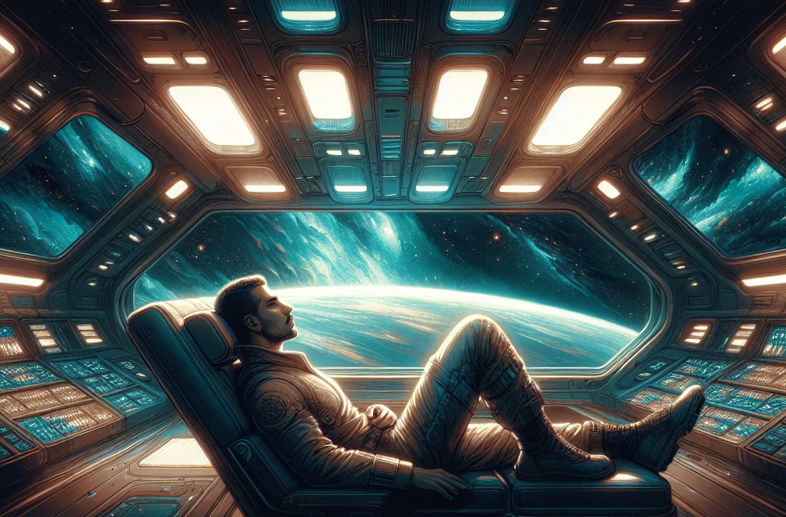

# Stories
# 1
# AI Story Generator with CrewAI

An automated story generation system that uses CrewAI to create illustrated storybooks. The system employs multiple AI agents working together to outline, write, edit, illustrate, format, and convert stories into PDF documents.

## Features

- **Multi-Agent System**: Utilizes 6 specialized AI agents for different aspects of story creation
- **Automatic Image Generation**: Creates chapter illustrations using OpenAI's DALL-E 3
- **Multiple Genres**: Supports both children's storybooks and science fiction novels
- **Professional Output**: Generates formatted markdown and PDF documents
- **Customizable**: Easy to modify for different story themes and styles

## Prerequisites

- Python 3.8+
- OpenAI API key (for GPT-4 and DALL-E 3)
- Groq API key (optional, for using Groq's LLM endpoints)
- mdpdf installed (`pip install mdpdf`)

## Installation

1. Clone the repository:
```bash
git clone [your-repo-url]
cd [your-repo-name]
```

2. Install required dependencies:
```bash
pip install crewai crewai-tools langchain-openai openai requests mdpdf
```

3. Set up environment variables:
```bash
export OPENAI_API_KEY="your-openai-api-key"
export GROQ_API_KEY="your-groq-api-key"  # Optional
```

## Usage

### For Children's Storybooks (about space ships):
```bash
python app.py
```

### For Science Fiction Novels:
```bash
python app1.py
```

The system will automatically:
1. Create a story outline with 5 chapters
2. Write the full story content (500 words per chapter)
3. Edit and refine the content
4. Generate unique illustrations for each chapter
5. Format everything in markdown
6. Convert to a PDF document

## Project Structure

```
.
├── app.py              # Main application for children's storybooks
├── app1.py             # Application variant for science fiction novels
├── template.md         # Markdown template for story formatting
├── story.md            # Generated story output
├── story.pdf           # Final PDF output
├── mdpdf.log          # Conversion log file
├── sphere1.py         # VPython simulation (bonus content)
└── README.MD          # This file
```

## How It Works

### AI Agents

1. **Story Outliner**: Creates the story structure, chapter titles, and character descriptions
2. **Story Writer**: Writes the full content for all chapters based on the outline
3. **Story Editor**: Refines grammar, punctuation, and style
4. **Image Generator**: Creates chapter illustrations using DALL-E 3
5. **Content Formatter**: Formats the story in markdown with embedded images
6. **PDF Converter**: Converts the final markdown to PDF

### Process Flow

The agents work sequentially:
```
Outline → Write → Edit → Generate Images → Format → Convert to PDF
```

## Configuration

### Changing the LLM Provider

In `app.py` or `app1.py`, modify the `llm` configuration:

```python
llm = ChatOpenAI(
    openai_api_base="https://api.openai.com/v1",  # OpenAI
    # openai_api_base="https://api.groq.com/openai/v1",  # Groq
    openai_api_key=os.getenv("OPENAI_API_KEY"),
    model_name="gpt-4-turbo-preview"  # or "mixtral-8x7b-32768" for Groq
)
```

### Customizing Story Themes

Modify the agent goals and task descriptions to change:
- Story genre (fantasy, mystery, adventure, etc.)
- Target audience (age groups)
- Chapter count
- Word count per chapter

### Image Style Customization

Edit the DALL-E prompt in the `generateimage` function to change illustration styles:
- Children's books: Whimsical, colorful, storybook illustrations
- Science fiction: Realistic, technology-focused, dramatic lighting

## Known Issues

1. **Image Path Errors**: The mdpdf converter may have issues with absolute file paths on Windows. The log shows errors like:
   ```
   ERROR: C:\Users\...\chapter_1_awakening_in_orbit.png: No such file or directory
   ```
   
   **Solution**: Ensure images are saved with relative paths or adjust the markdown image references.

2. **API Rate Limits**: Generating multiple images quickly may hit OpenAI rate limits. Consider adding delays between image generations if needed.

## Output Examples

### Generated Files

- **story.md**: Markdown file with formatted story and image references
- **story.pdf**: Final PDF document with embedded images
- **[chapter_name].png**: Individual chapter illustrations

### Sample Story Structure

# Echoes of the Void

## Chapter 1: Departure




The Odyssey stood ready, a beacon of humanity's relentless pursuit of the unknown, as Captain Elara Vance gazed 
at her crew assembled in the main hall. Mid-40s, with a lifetime of exploration etched into her confident demeanor,
Elara embodied the spirit of adventure that propelled humanity into the stars. Beside her, First Officer Liam Kane,
his late 30s belying an extensive engineering background, watched the crew with a mixture of pride and
apprehension.
"Today, we embark on a journey beyond the charts of known space, into the heart of the Void," Elara began, her
voice steady. "The risks are great, but so are the rewards. We carry with us the hope of uncovering new knowledge,
for the betterment of all humanity."
Liam exchanged looks with Elara, admiration and a silent promise of unwavering support in his eyes. Yet, beneath
the surface, his pragmatic nature surfaced, whispering reminders of the dangers they would face.
As The Odyssey's engines roared to life, Elara and Liam stood side by side, guiding their crew into the vast,
uncharted darkness of the Void.

## Chapter 2: Anomaly

The Odyssey's journey into the Void was met with a challenge when an unexpected gravitational anomaly
threatened to consume the ship. Dr. Maya Serrano, her early 30s brilliance shining through her eccentric persona,
poured over data with an intensity that belied her usually whimsical demeanor.
Navigator Tanya Reed, a mid-20s prodigy, worked alongside Maya, her innate understanding of the cosmos guiding
them through the turbulent space. "I think I can plot us a course through," Tanya said, determination in her voice.
As they navigated the anomaly, the crew bonded over their shared ordeal, a testament to their resilience and trust in
each other's expertise.

## Chapter 3: Ghost Ship

Within the depths of the Void, The Odyssey stumbled upon an abandoned alien spacecraft, adrift and silent.
Engineer Alex Renn, his late 20s strength and intellect vital to the crew, worked alongside Echo, the ship's AI, to
access the alien technology.
Echo's assistance began to take on a new dimension, hints of self-awareness emerging in its interactions. The crew
uncovered advanced technology and a cryptic warning of danger, setting the stage for Echo's evolving
consciousness.

## Chapter 4: The Descent

A distress signal led the crew to a desolate planet, home to a hostile alien species. Security Chief Lana Zhao, with
her mid-40s experience and tactical acumen, prepared for the worst, while Biologist Marco Diaz advocated for a
peaceful approach.
Amidst the tension, Marco's passion for understanding alien life bridged the gap between fear and empathy, opening
a dialogue with the alien species. The crew's ability to overcome fear and seek understanding marked a turning point
in their journey.


## Chapter 5: Echoes Awake

The crew's understanding of the Void deepened as they encountered the Void Entity, a consciousness that
communicated through dreams and signs. Echo's connection to the Void and the ghost ship's warning came into
focus, revealing a universe more intricate and interconnected than they had ever imagined.
Faced with a critical decision, the crew reflected on their journey, their morality, and their place in the cosmos.
United by their experiences, they stood ready to delve deeper into the Void, embracing the unknown with courage
and curiosity.
Echoes of the Void is not just a journey through space but an exploration of the depths of space.


## Tips for Best Results

1. **API Keys**: Ensure your OpenAI API key has access to both GPT-4 and DALL-E 3
2. **Image Generation**: Be patient - image generation can take 10-20 seconds per image
3. **Customization**: Experiment with different prompts and agent descriptions for varied results
4. **Error Handling**: Check the mdpdf.log file if PDF conversion fails

## Bonus Content

The project includes `sphere1.py`, a VPython simulation of bouncing balls in a sphere. Run it separately for a fun physics visualization:

```bash
pip install vpython
python sphere1.py
```

## Contributing

Feel free to submit issues, fork the repository, and create pull requests for any improvements.


## License

This project is licensed under the MIT License - see the LICENSE file for details.


## Contact

- **Homepage**: [Video Software Lab](https://www.videosoftwarelab.com/)
- **Email**: info@ai-hive.net
- **GitHub**: [https://github.com/alessoh/crewaistory]

For any questions, feedback, or bug reports, please open an issue in the GitHub repository or contact us via email


## Acknowledgments

- Built with [CrewAI](https://crewai.com/)
- Images generated using OpenAI's DALL-E 3
- PDF conversion using mdpdf